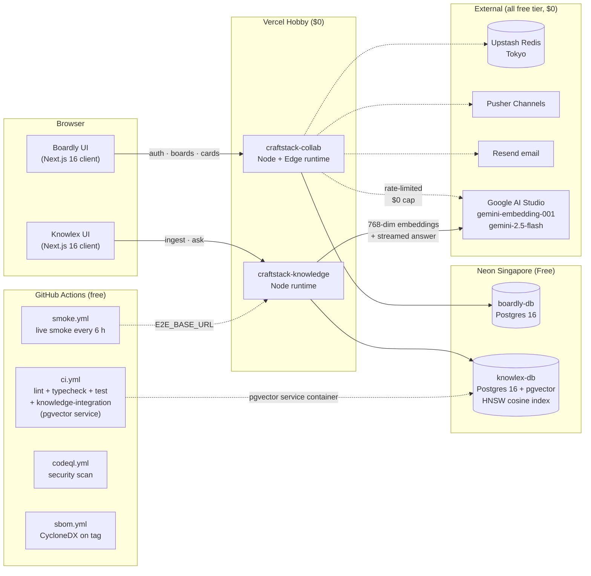

# craftstack

[](https://github.com/leagames0221-sys/craftstack/actions/workflows/ci.yml)
[](https://securityheaders.com/?q=https%3A%2F%2Fcraftstack-collab.vercel.app%2F&followRedirects=on)
[](./apps/collab)
[](#tech-stack)
[](./docs/adr/0046-zero-cost-by-construction.md)
[](./LICENSE)
[](./.nvmrc)
[](./package.json)
[](https://nextjs.org)
[](https://www.typescriptlang.org)

> Full-stack portfolio monorepo — **Boardly** (realtime collaborative kanban with drag-and-drop, multi-tenant workspaces) + **Knowlex** (single-tenant RAG demo on pgvector HNSW + Gemini; workspace schema partitioning shipped per [ADR-0047](docs/adr/0047-knowlex-workspace-tenancy-plan.md) partial in v0.5.0; auth-gated access control deferred to v0.5.4 once Auth.js lands on the Knowlex deploy).

Two production-grade SaaS applications designed and built from schema to deploy, as a solo developer, to demonstrate full-stack × from-scratch engineering capability.

## 🎬 Walkthroughs

Two narrated demos, one per app. Japanese narration via VOICEVOX (speaker: ずんだもん, free tier); pipeline reproducible end-to-end — see [`scripts/demo/`](scripts/demo/) + [`scripts/demo-knowlex/`](scripts/demo-knowlex/).

- [▶️ **Boardly** — 45 s walkthrough](https://www.loom.com/share/1f6915e588cb4176bfc8272f0f9310bb) — DnD, labels, assignees, @mentions + notifications bell, invitations with the acceptUrl flow, activity feed, and the architectural decisions summary.
- [▶️ **Knowlex** — 33 s RAG walkthrough](https://www.loom.com/share/acff991e3da94d5aa4e98dcee0b100e2) — `/kb` ingest (chunk → 768-dim embed), `/` ask (pgvector HNSW cosine kNN → streamed Gemini 2.0 Flash with numbered citations), `/api/kb/stats` live index-type probe, `/docs/api` hand-written OpenAPI 3.1.

## 🗺️ Architecture



All production services are free-tier, no credit-card-on-file. Step-by-step signup guide in [`docs/FREE_TIER_ONBOARDING.md`](docs/FREE_TIER_ONBOARDING.md); cost-attack threat model in [`COST_SAFETY.md`](COST_SAFETY.md).

## 🌐 Live demo

**Boardly**: <https://craftstack-collab.vercel.app>

**Knowlex** (grounded RAG, own Vercel deploy): <https://craftstack-knowledge.vercel.app> — add documents at [`/kb`](https://craftstack-knowledge.vercel.app/kb), then ask questions at [`/`](https://craftstack-knowledge.vercel.app/). Chunked via a 512-char paragraph-aware splitter, embedded with `gemini-embedding-001` at 768 dimensions (via `outputDimensionality`) into **pgvector** backed by an **HNSW cosine index** (see [ADR-0041](docs/adr/0041-knowlex-ivfflat-to-hnsw.md)), retrieved by cosine kNN, answered by Gemini 2.0 Flash with numbered citations.

**Knowlex Playground (bring-your-own-context)**: <https://craftstack-collab.vercel.app/playground> — same Gemini pipeline but you paste the context inline instead of ingesting.

Sign in to reach the authenticated dashboard. Workspace + board creation flows are wired end-to-end against Neon Postgres (Singapore) and Upstash Redis (Tokyo).

> **Reviewers**: **Continue with GitHub** is the recommended button — it works for any GitHub account out of the box. The Google OAuth app is still in Google's "Testing" status, so Google sign-in will only succeed for email addresses already registered as test users inside the Google Cloud consent screen. Publishing the Google app requires verification review and is deferred until the app is feature-complete.

Invitations (token-hashed, email-bound, three-layer rate-limited per [ADR-0026](docs/adr/0026-token-hashed-invitations.md) / [ADR-0027](docs/adr/0027-three-layer-invitation-rate-limit.md)) and the Knowlex RAG experience (pgvector HNSW + streamed Gemini 2.0 Flash with numbered citations per [ADR-0039](docs/adr/0039-knowlex-mvp-scope.md) / [ADR-0041](docs/adr/0041-knowlex-ivfflat-to-hnsw.md)) are both shipped and live. Attachments (Cloudflare R2 per [ADR-0008](docs/adr/0008-cloudflare-r2.md)) are schema-ready at the Prisma layer; UI wiring is a follow-up.

## Apps

| App                           | Description                                                                                                                                                                                                                                                             | Tech highlights                                                                                             | Status               |
| ----------------------------- | ----------------------------------------------------------------------------------------------------------------------------------------------------------------------------------------------------------------------------------------------------------------------- | ----------------------------------------------------------------------------------------------------------- | -------------------- |
| [**Boardly**](apps/collab)    | Collaborative kanban with drag-and-drop and realtime fanout                                                                                                                                                                                                             | Next.js 16 · Auth.js v5 · Prisma 7 · PostgreSQL · LexoRank · Optimistic lock · `@dnd-kit` · Pusher Channels | v0.1.0 — live deploy |
| [**Knowlex**](apps/knowledge) | Single-tenant RAG demo — pgvector HNSW kNN + streamed Gemini with numbered citations. Workspace schema partitioning shipped per [ADR-0047](docs/adr/0047-knowlex-workspace-tenancy-plan.md) partial in v0.5.0; auth-gated access control deferred to v0.5.4 (next arc). | Next.js · pgvector (HNSW) · Gemini Embeddings · Gemini 2.0 Flash streaming · Prisma                         | MVP live deploy      |

## Monorepo layout

```
craftstack/
├── apps/
│   ├── collab/              # Boardly
│   └── knowledge/           # Knowlex
├── packages/
│   ├── ui/                  # shadcn/ui based shared components
│   ├── auth/                # Auth.js v5 wrapper
│   ├── db/                  # Prisma client + withTenant() helper
│   ├── logger/              # pino + Sentry
│   ├── config/              # ESLint / TSConfig / Prettier presets
│   └── api-client/          # OpenAPI-generated types
├── infra/
│   └── docker/              # docker-compose + init scripts
├── docs/
│   ├── design/              # 13-part design bible (see docs/design/README.md)
│   ├── adr/                 # Architecture Decision Records (50 entries)
│   ├── api/                 # OpenAPI specs
│   ├── architecture/        # System diagrams
│   ├── compliance/          # Data retention policy
│   ├── eval/                # RAG evaluation (golden QA + reports)
│   ├── hiring/              # Interview Q&A + portfolio LP + demo storyboards
│   ├── ops/                 # Runbook
│   └── security/            # STRIDE threat model
└── .github/workflows/       # CI / deploy / eval
```

## Tech stack

### Shipped in v0.1.0

- **Frontend**: Next.js 16 (App Router, Turbopack) · TypeScript 5 · TailwindCSS 4
- **Backend**: Next.js Route Handlers on Node runtime · Edge Runtime proxy
- **Database**: PostgreSQL 16 on Neon (Singapore) · Prisma 7 with `@prisma/adapter-pg`
- **Auth**: Auth.js v5 with JWT session strategy · Google + GitHub OAuth · PrismaAdapter
- **Deploy**: Vercel Hobby · GitHub Actions CI (lint / typecheck / test / build)
- **Security headers** — scored **A** on [securityheaders.com](https://securityheaders.com/?q=https%3A%2F%2Fcraftstack-collab.vercel.app%2F&followRedirects=on). Layers: Content-Security-Policy with explicit Vercel-platform allowlists + `'unsafe-inline'` (W3C-spec rollback from the earlier A+ nonce + `'strict-dynamic'` stance — platform-injected scripts couldn't carry our per-request nonce and hydration broke; see ADR-0040), HSTS 2y preload, X-Frame-Options DENY, Cross-Origin-Opener-Policy same-origin, Cross-Origin-Resource-Policy same-origin, Permissions-Policy denying every unused sensor / media / power API, and Referrer-Policy strict-origin-when-cross-origin
- **Testing**: Vitest (**206** unit cases across both apps — 166 collab + 40 knowledge) · Playwright (**~35** scenarios — smoke, authed E2E, a11y, live-URL, run with `pnpm --filter collab test:e2e` / `pnpm --filter knowledge test:e2e`) · Knowlex retrieve integration test against a real `pgvector` service container via `docker compose` (`pnpm --filter knowledge test:integration`) · k6 scenario
- **Drag & drop**: `@dnd-kit` sortable cards with LexoRank positions + optimistic UI + `VERSION_MISMATCH` rollback
- **Realtime**: Pusher Channels (free tier) — `board-<id>` fanout for card/list mutations; no-op locally when unconfigured
- **Invitations**: Token-hashed invitation flow (ADMIN+ creates, accept page binds membership). Resend-backed email delivery with graceful fallback to console log when `RESEND_API_KEY` is unset
- **Abuse defence**: Three-layer rate limits on invitation creation (global 1000/mo, per-workspace 50/day, per-user 20/day) — all env-override-able, 429 with specific error code on trip
- **Card comments**: thread per card with author + ADMIN-moderator deletion, soft-delete, 4000-char cap, Pusher fanout on create/delete
- **Activity log**: audit feed per workspace (card/list/comment create/update/move/delete) with cursor pagination, human-readable summaries, best-effort logging (log insert failure never aborts the business mutation)
- **Labels**: workspace-scoped color-coded labels (ADMIN-curated palette), full-replace attach API with cross-workspace guard, dots on board cards + inline picker on the card modal
- **@mentions + Notifications bell**: comment body is scanned for `@handle` tokens (email-local-part or display-name match against workspace members), Mention rows + per-user Notification rows are written, header bell polls `/api/notifications` every 30s and shows an unread badge with a deep-link dropdown
- **Card assignees**: full-replace PUT with membership guard (cross-workspace assigns rejected), avatar stack on board cards with +N overflow, modal picker listing workspace members, newly-added assignees get an ASSIGNED notification (self-assigns silent)
- **Board label filter**: URL-driven (`?labels=id1,id2`) chip bar above the board — shareable, survives refresh, union semantics (card shown if it has **any** active label)
- **WIP limits per list** (ADMIN+): inline `⚙` editor on list headers, amber header at-limit, red border + ring when over, back-end validates positive integer or null
- **Command palette (⌘K / Ctrl-K)**: global overlay with dark glassmorphism, fuzzy cross-workspace search of workspaces / boards / cards (all membership-scoped server-side via `/api/search`), plus a `>`-prefix action mode for "New workspace" / "New board" / "Sign out". Mounted on every authenticated header; empty query also renders recent workspaces + boards so it doubles as a jump-to navigator
- **Knowlex playground** at `/playground` (public, no signup, lives on the collab deploy): paste any passage + ask a question → streamed Gemini 2.0 Flash answer grounded only in the pasted context. Env-guarded with a deterministic demo-mode fallback so the page works end-to-end without `GEMINI_API_KEY`; per-IP + global budget caps
- **Knowlex MVP (live, end-to-end RAG)** — the full RAG app in [`apps/knowledge`](apps/knowledge): paste text at `/kb` → chunked (paragraph-aware, ~512 chars with 80-char overlap) → embedded with `gemini-embedding-001` at 768 dimensions (via `outputDimensionality`) → stored in **pgvector** behind an **HNSW cosine index** → cosine-kNN retrieval at query time → streamed Gemini 2.0 Flash answer with numbered citations. Running on its own Vercel project against a dedicated Neon `knowlex-db` (Singapore) per [ADR-0018](docs/adr/0018-db-instance-per-app.md). MVP scope in [ADR-0039](docs/adr/0039-knowlex-mvp-scope.md); the ivfflat → HNSW swap forced by a silent-zero-rows pathology at corpus=2 is documented in [ADR-0041](docs/adr/0041-knowlex-ivfflat-to-hnsw.md)
- **Keyboard shortcuts** (`?` opens a modal reference): `⌘/Ctrl+K` or `/` opens the command palette from anywhere, `>` switches it into action mode, `Esc` closes any modal. The help modal enumerates everything and is mounted on every authenticated header
- **Accessibility** — axe-core runs against every public **and** authenticated page in Playwright, now as a **PR-blocking gate** (previously only the 6-hourly `smoke.yml` cron caught regressions post-merge). `ci.yml` spins up pgvector + the Knowlex dev server to gate `/`, `/kb`, `/docs/api`; `e2e.yml` piggybacks on the already-running Boardly server to gate `/`, `/signin`, `/playground`. Public pages gate on zero `serious`+`critical` WCAG 2.1 AA violations; authenticated pages (`/dashboard`, `/w/...`) gate on zero `critical` only — `serious` warnings are logged but non-blocking pending a color-contrast polish sweep on dense secondary metadata. See [ADR-0034](docs/adr/0034-axe-core-a11y-in-playwright-smoke.md) and [ADR-0046](docs/adr/0046-zero-cost-by-construction.md) (PR-gate rationale)
- **Authenticated E2E** — a dedicated CI workflow ([`e2e.yml`](.github/workflows/e2e.yml)) boots a Postgres service container, seeds the DB, signs in via a CI-only Credentials provider (triple-gated: `NODE_ENV !== "production"`, `E2E_ENABLED=1`, `E2E_SHARED_SECRET` constant-time compare against a 3-email allowlist) and runs a Playwright suite covering dashboard, workspace, board, rate-limits, and authed a11y. See [ADR-0038](docs/adr/0038-e2e-credentials-provider-implementation.md)
- **Bundle analyzer** via `@next/bundle-analyzer` — `pnpm --filter collab analyze` spits out a client / server / edge bundle report at `apps/collab/.next/analyze/` for at-a-glance chunk-size regressions
- **OpenAPI 3.1 contract** at [`apps/collab/src/openapi.ts`](apps/collab/src/openapi.ts). Browsable in-app at <https://craftstack-collab.vercel.app/docs/api> (server-rendered, inside the strict CSP, zero external CDN), served as raw JSON at <https://craftstack-collab.vercel.app/api/openapi.json>. Hand-written so the spec **is** the contract ([ADR-0035](docs/adr/0035-hand-written-openapi-as-the-contract.md)). `pnpm --filter collab generate:api-types` emits a fully-typed `paths` interface into [`src/openapi-types.ts`](apps/collab/src/openapi-types.ts) via `openapi-typescript`
- **Release hygiene** — human-readable [CHANGELOG.md](CHANGELOG.md) per Keep-a-Changelog, signed tags, GitHub Releases, and a **CycloneDX 1.5 SBOM** auto-generated and attached to every `v*` release (see [`.github/workflows/sbom.yml`](.github/workflows/sbom.yml)) for supply-chain inspection
- **Undo / redo on card moves** — `Ctrl-Z` / `⌘-Z` reverses the last drag, `Ctrl-Shift-Z` / `⌘-Shift-Z` re-applies it. Bounded 25-entry LIFO stack, replays against the existing optimistic-lock-protected `/api/cards/:id/move` endpoint so concurrent-edit rejection behaves exactly like a fresh drag. Pure state-machine module (6 Vitest cases) in [ADR-0036](docs/adr/0036-move-undo-redo-client-only.md)
- **Cost safety by construction** — every service the project touches (Vercel, Neon, Gemini via AI Studio, Pusher, Resend, GitHub Actions, Upstash, Sentry) is on a free tier that **caps out to zero cost** rather than auto-scaling to the attacker's credit card. In-code defense-in-depth: per-IP + global daily/monthly budget on `/api/kb/ask` **and** `/api/kb/ingest` (Knowlex parity, see [ADR-0043](docs/adr/0043-knowlex-ops-cost-ci-eval.md)), per-user rate limits on authenticated reads, three-layer cap on invitation emails. The guarantee is enforced, not declared: [`scripts/check-free-tier-compliance.mjs`](scripts/check-free-tier-compliance.mjs) runs as a **PR-blocking `free-tier-compliance` gate** in [`ci.yml`](.github/workflows/ci.yml) that fails merges introducing paid-plan `vercel.json`, billable SDKs, or leaked secret patterns. A single-flag kill switch `EMERGENCY_STOP=1` short-circuits every write + AI endpoint on the next request (runbook §9); its counterpart observability endpoint [`/api/kb/budget`](https://craftstack-knowledge.vercel.app/api/kb/budget) mirrors `/api/kb/stats` to expose the current used/cap state. STRIDE threat model covers this attack shape explicitly as `C-01..C-06`. Decision record: [ADR-0046](docs/adr/0046-zero-cost-by-construction.md). Credit-card-free signup walk-through in [`docs/FREE_TIER_ONBOARDING.md`](docs/FREE_TIER_ONBOARDING.md); cost-attack threat model in [`COST_SAFETY.md`](COST_SAFETY.md)
- **Error-capture pipeline with demo mode** — both apps boot `@sentry/nextjs` via Next's `instrumentation.ts` + `instrumentation-client.ts` hooks; server and browser errors, unhandled rejections, and every `error.tsx` boundary flow through a unified `lib/observability.ts` seam. When `SENTRY_DSN` is configured the captures ship upstream; when it's not, they land in an in-memory ring buffer surfaced at `/api/observability/captures`, so a reviewer can prove the pipeline works end-to-end **without signing up for Sentry**. Rationale in [ADR-0044](docs/adr/0044-knowlex-openapi-a11y-sentry-v0.4.0.md) (wiring) and [ADR-0045](docs/adr/0045-observability-demo-mode.md) (demo-mode dual-backend)
- **Knowlex RAG regression stack** — `retrieve.integration.test.ts` exercises the real pgvector kNN path against a `pgvector/pgvector:pg16` service container in CI, asserting "returns every row when `k ≥ corpus size`" — the exact regression a misconfigured ivfflat(lists, probes) silently produces ([ADR-0041](docs/adr/0041-knowlex-ivfflat-to-hnsw.md) documents the production diagnosis). `scripts/bench-retrieve.ts` reports min / p50 / p95 / p99 / max latency over N=1000 / M=100 probes. `scripts/eval.ts` seeds a self-contained **10-doc / 30-question golden set v4** (21 OR-mode + 6 AND-mode + 3 adversarial) and scores substring-faithfulness + citation-coverage + refusal correctness against the live deploy — full measurement methodology in [ADR-0042](docs/adr/0042-knowlex-test-observability-stack.md) / [ADR-0043](docs/adr/0043-knowlex-ops-cost-ci-eval.md) / [ADR-0049 § 7th arc](docs/adr/0049-rag-eval-client-retry-contract.md) (substring-OR scoring + 12 expanded refusal markers) and [`docs/eval/README.md`](docs/eval/README.md)
- **Live deploy smoke, scheduled** — [`.github/workflows/smoke.yml`](.github/workflows/smoke.yml) runs Playwright against both production URLs every 6 h (plus on `workflow_dispatch` and on main pushes after a 90-second Vercel-settle sleep). Knowlex smoke asserts `indexType === "hnsw"` so an accidental ivfflat rollback trips the workflow, not production users
- **Demo video pipeline** (`pnpm demo:tts && pnpm demo:compose`): capture a silent screen recording once, and an ffmpeg+TTS toolchain overlays a fully synthesized Japanese narration. Pluggable providers — **VOICEVOX** (local, $0) or **Azure Neural TTS** (500k chars/mo free). Script lives as JSON; editing the story is two commands away from a new mp4. See [scripts/demo/README.md](scripts/demo/README.md)

### Planned (see [Roadmap](#roadmap))

- Storage: Vercel Blob (free tier)
- Observability: Sentry webpack-plugin source-map upload (SDK + capture already shipped) · Better Stack · UptimeRobot · pino · Web Vitals
- AI (Knowlex): pgvector HNSW + streamed Gemini 2.0 Flash with citations **already shipped** in v0.4.0; planned extensions — Cohere Rerank · HyDE · BM25 hybrid · LLM-as-judge faithfulness scoring in `scripts/eval.ts`
- Load: k6 (200 VU)

All production services are targeted to run within free-tier quotas (**$0/month**).

## How this was built

This codebase is AI-assisted. Claude (Anthropic's Claude Code) was used as a pair-programmer for scaffolding, boilerplate, and tests; every architectural decision below was author-specified and author-reviewed before being committed. The author can whiteboard any of these patterns from scratch in an interview.

**Non-obvious decisions made in this repo, with rationales:**

- **Four-tier RBAC (OWNER > ADMIN > EDITOR > VIEWER)** with a single `roleAtLeast` comparator driving every server check. Chosen over boolean flags so the model scales to per-feature gates (labels ADMIN+, comments EDITOR+, activity VIEWER+) without schema churn.
- **Optimistic locking via `version` column** on Card. `updateMany` filters by `id + version`, 0 rows affected → 409 `VERSION_MISMATCH`. The client bumps its local version on success so rapid drags don't stale-conflict with themselves. Chosen over pessimistic locking because multiple editors on the same board is the norm.
- **LexoRank positions** for List + Card ordering. Reordering touches **one row** (`between(prev, next)`), not N. Using the `lexorank` npm package for Jira-compatible semantics.
- **Token-hashed invitations**. Plaintext token exists only in the email / UI; only `SHA-256(token)` is persisted. Accept requires the signed-in email to match the invitation's email — defeats token phishing and accidental link sharing.
- **Three-layer invitation rate limit** (global 1000/mo, per-workspace 50/day, per-user 20/day), counts include revoked+accepted rows so an attacker can't reset quota by revoking. Trip returns a specific error code so the UI explains which quota fired.
- **Full-replace set semantics** for labels and assignees (`PUT /api/cards/:id/labels` with the desired `labelIds[]`). Simpler to reason about than two endpoints; the server diffs against current state and emits the right notifications for adds only (no spam on removes).
- **Cross-workspace guards** on both `setCardLabels` and `setCardAssignees`. A card in workspace A cannot be tagged with a label from workspace B, cannot be assigned to a user who isn't a member. Defense in depth against tenant leaks from a malicious or buggy client.
- **Best-effort side effects**. Activity log inserts, Pusher broadcasts, Resend emails, and notification rows are all wrapped so a failure cannot abort the originating business write. Every one catches + console.warns and returns — the user's card save is the transactional piece; fanout is cosmetic.
- **URL as source of truth** for board filters (`?labels=…`, `?q=…`). Shareable, refresh-survives, composable. Chosen over a local React store so a user can paste a filtered-board URL into Slack.
- **@mention resolution**: email local-part OR display-name slug. The regex is tuned to _not_ match email addresses in running text (`contact me at alice@example.com` doesn't fire).
- **Env-guarded integrations** (Pusher, Resend). Missing credentials = silent no-op with a fallback (console log of accept URL, cross-tab refresh skipped). Means the app runs end-to-end locally without any external signup.

Each of the ten items above is also captured as a one-page Architectural Decision Record with alternatives and trade-offs: see [`docs/adr/`](docs/adr/README.md) — ADR-0023 through ADR-0032 are the implementation-phase records mapping 1-to-1 to this list.

See also the per-module doc comments in `apps/collab/src/server/*.ts` — each exported function has a short rationale for the specific design choice.

## Local development

### Prerequisites

- Node.js 20 LTS (`.nvmrc` pinned)
- pnpm 9+ (`packageManager` field pinned)
- Docker Desktop

### Boot

```bash
git clone https://github.com/leagames0221-sys/craftstack.git
cd craftstack
cp .env.example .env
docker compose up -d          # Postgres + Redis
pnpm install
pnpm dev:collab               # Boardly  on http://localhost:3000
pnpm dev:knowledge            # Knowlex  on http://localhost:3001
```

## Documentation map

| Area                    | Entry point                                                                           |
| ----------------------- | ------------------------------------------------------------------------------------- |
| Architecture overview   | [docs/architecture/system-overview.md](docs/architecture/system-overview.md)          |
| Decision records (22)   | [docs/adr/](docs/adr/README.md)                                                       |
| API specs (OpenAPI)     | [collab](docs/api/collab-openapi.yaml) · [knowledge](docs/api/knowledge-openapi.yaml) |
| Rate limits             | [docs/api/rate-limits.md](docs/api/rate-limits.md)                                    |
| STRIDE threat model     | [docs/security/threat-model.md](docs/security/threat-model.md)                        |
| Incident runbook        | [docs/ops/runbook.md](docs/ops/runbook.md)                                            |
| Data retention policy   | [docs/compliance/data-retention.md](docs/compliance/data-retention.md)                |
| RAG prompt registry     | [apps/knowledge/src/server/ai/prompts/](apps/knowledge/src/server/ai/prompts/)        |
| RAG evaluation          | [docs/eval/](docs/eval/README.md)                                                     |
| Interview Q&A (30)      | [docs/hiring/interview-qa.md](docs/hiring/interview-qa.md)                            |
| Portfolio landing copy  | [docs/hiring/portfolio-lp.md](docs/hiring/portfolio-lp.md)                            |
| Demo storyboard         | [docs/hiring/demo-storyboard.md](docs/hiring/demo-storyboard.md)                      |
| Design bible (13 parts) | [docs/design/README.md](docs/design/README.md)                                        |
| Contribution guide      | [CONTRIBUTING.md](CONTRIBUTING.md)                                                    |

## Roadmap

### Shipped

- ✅ **Week 1–2** — Monorepo scaffolding, CI, Docker Compose
- ✅ **Week 3** — Prisma schema (17 models), Auth.js v5 OAuth (Google+GitHub), 4-tier RBAC, initial Vitest suite (40 cases at the time, now **206**)
- ✅ **Boardly v0.1.0** — Deployed to Vercel + Neon + Upstash; authenticated dashboard, workspace & board CRUD
- ✅ **Week 4** — Resend-backed workspace invitations with token-hashed accept flow (7-day expiry, revocable, email-matching enforcement)
- ✅ **Week 5** — Card/List CRUD with optimistic lock, editor modal, `@dnd-kit` drag-and-drop
- ✅ **Week 6** — Pusher Channels realtime fanout (card/list mutations broadcast to peers on the same board)
- ✅ **Week 7–9** — Search (⌘K command palette + label filter, membership-scoped server-side), notifications (mention bell + Notification rows + unread badge polling)
- ✅ **Demo videos** — Boardly 45 s + Knowlex 33 s narrated walkthroughs (VOICEVOX, free tier, fully reproducible pipeline)
- ✅ **Knowlex MVP through v0.5.2** — full RAG live: ingestion (paragraph-aware 512-char chunking → 768-dim `gemini-embedding-001` → pgvector HNSW cosine kNN), streamed Gemini 2.0 Flash with numbered citations, nightly eval cron + golden v4 OR-mode scoring (ADR-0049 § 7th arc), workspace schema partitioning (ADR-0047 partial), schema-vs-prod drift fix + `vercel-build` migration regime (ADR-0051), drift-detect-v2 via `pg_catalog` assertion gating PRs

### Planned

- 🚧 **Presence indicators / cursor sharing** — Pusher presence channels, follow-up to Week 6
- ⏳ **Attachments (Cloudflare R2)** — schema-ready at the Prisma layer per [ADR-0008](docs/adr/0008-cloudflare-r2.md); UI wiring follow-up
- ⏳ **Multi-language** support and **k6 load-test** scenario execution (k6 script exists, measured run pending)
- ⏳ **Knowlex retrieval extensions** — hybrid search (BM25 + vector via RRF), HyDE, Cohere Rerank, all named in [ADR-0011](docs/adr/0011-hybrid-search-rerank.md) / [ADR-0014](docs/adr/0014-hyde.md)
- ⏳ **LLM-as-judge `--judge` flag** in `scripts/eval.ts` (gemini-2.5-pro rubric, optional env-toggled CI job so the default eval stays $0)
- ⏳ **Auth.js on Knowlex + `WorkspaceMember` access-control** (v0.5.4 arc, the access-control half of [ADR-0047](docs/adr/0047-knowlex-workspace-tenancy-plan.md) § Status)
- ⏳ **HNSW tuning at 10 k-chunk corpus** — measured p95 × `ef_search` × `m` grid in `docs/eval/HNSW_TUNING.md`, hourly background ingest under the 1500 RPD AI Studio cap (v0.6.0)

## License

MIT — see [LICENSE](LICENSE).
