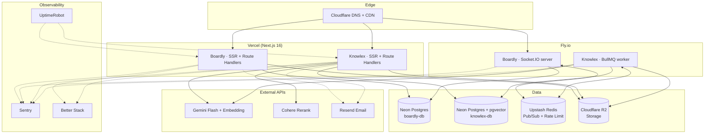

# System overview



## Separation of concerns

| Layer             | Boardly                                | Knowlex                                      |
| ----------------- | -------------------------------------- | -------------------------------------------- |
| SSR / API         | Vercel Hobby                           | Vercel Hobby                                 |
| Realtime / Worker | Fly.io `shared-cpu-1x` × 1 (Socket.IO) | Fly.io `shared-cpu-1x` × 1 (BullMQ)          |
| Database          | Neon `boardly-db` (pg_trgm)            | Neon `knowlex-db` (pg_trgm + pgvector + RLS) |
| Cache / Pub-Sub   | Upstash Redis                          | Upstash Redis (shared)                       |
| Storage           | Cloudflare R2 bucket `boardly`         | Cloudflare R2 bucket `knowlex`               |

Databases are deliberately separated per app (ADR-0018) so Knowlex pgvector workloads cannot steal capacity from Boardly realtime queries.

## Request path examples

### Boardly: edit a card

1. Browser PATCH `/api/cards/:id` with `version` → Vercel Route Handler
2. Route handler validates, UPDATE on Neon `boardly-db`, emits event to Upstash via the Fly.io Socket.IO instance
3. Socket.IO broadcasts to all sockets in the `board:<id>` room across all Fly nodes (Pub/Sub glue)

### Knowlex: ask a question

1. Browser POST `/api/conversations/:id/messages` (SSE)
2. Server rewrites the query, optionally runs HyDE (Gemini), fans out hybrid retrieve (pgvector + BM25 on Neon), fuses via RRF, reranks via Cohere
3. Gemini Flash streams the answer; the server parses `<|cite:...|>` tokens into Citation rows
4. After the stream closes, a Faithfulness pass rescues any unverified sentences

```

```
