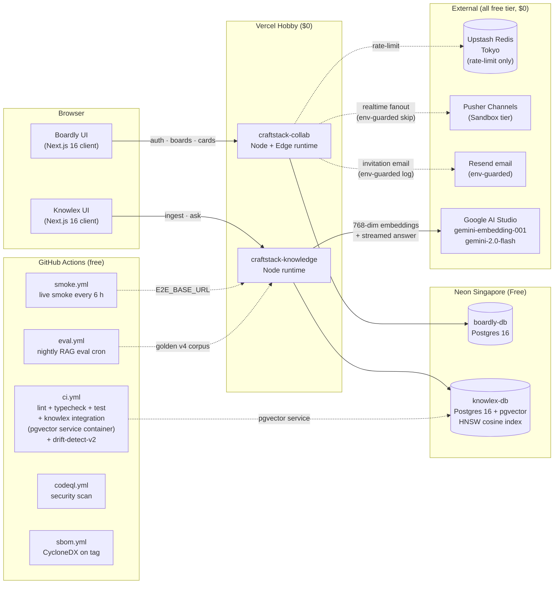

# System overview

> **Status (as of v0.5.6)**: this is the deployed architecture. The original ADR-0009 plan included Fly.io + Socket.IO + BullMQ; the implementation pivoted to Pusher Channels for ADR-0046 (zero-cost-by-construction) compliance — recorded in ADR-0052. The diagram + table below reflect what actually runs. v0.5.3 added green-run eval auto-commit + measured-eval README badge (ADR-0049 § 7th arc Tier C-#2); v0.5.4 added the runtime schema canary at `/api/health/schema` closing the runtime side of ADR-0051 (ADR-0053).

## Separation of concerns

| Layer           | Boardly                                 | Knowlex                                                |
| --------------- | --------------------------------------- | ------------------------------------------------------ |
| SSR / API       | Vercel Hobby (`craftstack-collab`)      | Vercel Hobby (`craftstack-knowledge`)                  |
| Realtime fanout | Pusher Channels Sandbox (env-guarded)   | n/a (request-response only)                            |
| Database        | Neon `boardly-db` (Postgres 16)         | Neon `knowlex-db` (Postgres 16 + pgvector HNSW cosine) |
| Rate limit      | Upstash Redis (Tokyo)                   | In-process per-IP + global budget per ADR-0046         |
| Email           | Resend (env-guarded; falls back to log) | n/a                                                    |
| Auth            | Auth.js v5 JWT + GitHub/Google OAuth    | Single-tenant (auth deferred to v0.5.4 per ADR-0047)   |
| AI              | Gemini Flash via `/playground`          | Gemini Flash + embedding-001                           |

Databases are deliberately separated per app per [ADR-0018](../adr/0018-db-instance-per-app.md) so Knowlex pgvector workloads cannot steal capacity from Boardly transactional queries.

## Request path examples

### Boardly: edit a card

1. Browser PATCH `/api/cards/:id` with last-seen `version` → Vercel Route Handler
2. Route handler validates, runs `updateMany` filtered by `id + version` on Neon `boardly-db`
3. On success (1 row affected): emits a Pusher Channels event to `board-<id>` channel; on failure (0 rows = stale): returns HTTP 409 `VERSION_MISMATCH` per [ADR-0007](../adr/0007-optimistic-locking.md)
4. Pusher fanout reaches every connected client subscribed to `board-<id>`; `BoardClient` applies the diff or marks the local entry stale per [ADR-0048](../adr/0048-undo-redo-optimistic-lock-semantics.md)
5. Pusher emit is wrapped per [ADR-0030](../adr/0030-best-effort-side-effects.md) — a Pusher outage cannot abort the card save

### Knowlex: ask a question

1. Browser POST `/api/kb/ask` with `{ question }` (SSE response)
2. Route handler resolves workspaceId via the `resolveWorkspaceId` fallback (single-tenant default `wks_default_v050` per ADR-0047 partial)
3. Embeds the question via `gemini-embedding-001` at 768 dim (matches stored corpus per ADR-0041)
4. Runs cosine kNN over pgvector HNSW index on Neon `knowlex-db`
5. Streams Gemini 2.0 Flash answer with numbered citations (`[1]`, `[2]`, ...) via SSE per ADR-0039 MVP scope
6. Per-IP and global daily/monthly budget caps apply per [ADR-0043](../adr/0043-knowlex-ops-cost-ci-eval.md) / [ADR-0046](../adr/0046-zero-cost-by-construction.md)

## What is **not** in this diagram (intentional, per ADR-0039 MVP scope)

- **Hybrid retrieval** (BM25 + vector via RRF) — design-phase ambition per ADR-0011, deferred
- **Cohere Rerank** — ADR-0011, deferred
- **HyDE** — ADR-0014, deferred
- **NLI Faithfulness check** — ADR-0013, deferred
- **PostgreSQL RLS** — ADR-0010, deferred (Knowlex is single-tenant per ADR-0039)
- **BullMQ worker** — original ADR-0009 component, removed by Pusher pivot (ADR-0052)
- **Cloudflare R2 storage** — schema-ready at Prisma layer per ADR-0008, UI wiring is a follow-up
- **Multi-region expansion** — post-v1.0 roadmap

The "what is not" list exists deliberately. A reviewer reading this overview should be able to predict every endpoint that exists vs. every endpoint that doesn't, with no surprise.
