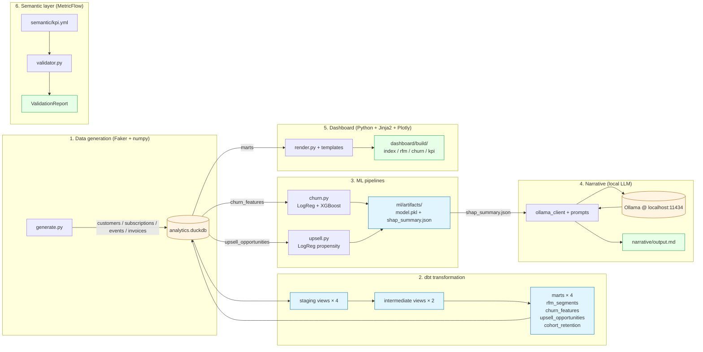

# Architecture — `@craftstack/data-analytics-demo`

End-to-end pipeline view. The same DuckDB file (`warehouse/analytics.duckdb`) is the load-bearing artifact — every layer either writes to it or reads from it.

## Pipeline



## Layer details

### 1. Data generation — `src/data_analytics_demo/data/`

| File          | Role                                                                                                                                          |
| ------------- | --------------------------------------------------------------------------------------------------------------------------------------------- |
| `schemas.py`  | Pydantic models (`Customer`, `Subscription`, `Event`, `Invoice`) define the column shapes the dbt sources expect.                             |
| `generate.py` | Faker (names / emails / companies) + numpy (deterministic distributions) → 4 tables in DuckDB. Seed lives in `DEMO_RANDOM_SEED` (default 42). |

The generator deliberately injects two patterns so the ML layer has something to learn:

- **Churn**: customers without active subscriptions get 4× lower event weight, and their timestamps are biased into the older half of the history window (so `recent_to_lifetime_ratio` carries signal).
- **Upsell**: `feature_use_premium` / `feature_use_advanced` events skew higher for paid tiers.

### 2. dbt transformation — `dbt_project/`

Standard staging → intermediate → marts layout, profiled to a local DuckDB. Marts are materialised as tables (the ML / dashboard layers read them); staging and intermediate stay as views.

| Mart                   | Grain                                           | Purpose                                                |
| ---------------------- | ----------------------------------------------- | ------------------------------------------------------ |
| `rfm_segments`         | one row per active customer                     | R / F / M quintile scoring + 5-bucket label            |
| `churn_features`       | one row per customer                            | Feature table for churn prediction; `is_churned` label |
| `upsell_opportunities` | one row per free/pro customer                   | Feature table for upsell propensity; `upgraded` label  |
| `cohort_retention`     | one row per (cohort_month, months_since_signup) | Monthly retention grid                                 |

20 schema tests (not_null, unique, accepted_values) enforce the contract on the marts.

### 3. ML — `src/data_analytics_demo/ml/`

| File         | Role                                                                                                                                 |
| ------------ | ------------------------------------------------------------------------------------------------------------------------------------ |
| `_io.py`     | Shared mart loader; raises clear errors when warehouse / mart is missing.                                                            |
| `churn.py`   | Trains a LogisticRegression baseline AND an XGBoost classifier on `churn_features`, picks the higher hold-out ROC-AUC (floor: 0.70). |
| `upsell.py`  | LogisticRegression propensity on `upsell_opportunities`; measures hold-out ROC-AUC and lift @ top-10% (floor: 1.5×).                 |
| `explain.py` | SHAP wrapper. TreeExplainer first; falls back to model-agnostic.                                                                     |

Determinism: every random-number-using step takes `random_state=42`. Re-running with the same seed produces byte-identical artifacts.

### 4. Narrative — `src/data_analytics_demo/narrative/`

| File               | Role                                                                                                                                                        |
| ------------------ | ----------------------------------------------------------------------------------------------------------------------------------------------------------- |
| `ollama_client.py` | Env-var-gated host + model resolution; runtime assertion that no cloud-LLM credentials are present (AC-4.3).                                                |
| `prompts.py`       | Executive-brief prompt template (SHAP summary → prompt is the only call point).                                                                             |
| `generate.py`      | Reads `shap_summary.json`, calls Ollama, wraps the body with provenance metadata (model id, source path, timestamp, "External LLM calls: 0" advertisement). |

### 5. Dashboard — `src/data_analytics_demo/dashboard/`

| File                  | Role                                                                                                              |
| --------------------- | ----------------------------------------------------------------------------------------------------------------- |
| `render.py`           | Reads marts via DuckDB, calls into `charts.py` and renders Jinja2 templates.                                      |
| `queries.py`          | Centralised SQL queries against the marts.                                                                        |
| `charts.py`           | Plotly figure builders (bar / scatter / line / area / heatmap). CDN-served plotly.js keeps per-page size ≤ 40 KB. |
| `templates/*.html.j2` | Base layout + index / rfm / churn / kpi pages.                                                                    |

The original design used Evidence (MIT) but its SvelteKit-based build chain hit four+ chained peer-dependency failures under pnpm 10's isolated layout. The amendment in [ADR-0070](../../../docs/adr/0070-data-analytics-demo-polyglot-adoption.md) documents the pivot.

### 6. Semantic layer — `src/data_analytics_demo/semantic/` + `semantic/kpi.yml`

| Asset              | Role                                                                                                                                                                   |
| ------------------ | ---------------------------------------------------------------------------------------------------------------------------------------------------------------------- |
| `semantic/kpi.yml` | MetricFlow-compatible semantic models (customers / subscriptions / invoices) + metrics (customers, active_subscriptions, mrr, paid_invoice_volume).                    |
| `validator.py`     | Pure-Python validator. Enforces required keys, non-empty dims/measures, cross-references. Independent of the MetricFlow CLI so the test suite has no shell dependency. |

## Files produced by a full `make demo` run

```
warehouse/analytics.duckdb            ← stages 1 + 2 + 5
ml/artifacts/churn_model.pkl          ← stage 3 (churn)
ml/artifacts/churn_metadata.json
ml/artifacts/shap_summary.json
ml/artifacts/upsell_model.pkl         ← stage 3 (upsell)
ml/artifacts/upsell_metadata.json
ml/artifacts/upsell_lift_report.json
narrative/output.md                   ← stage 4
dashboard/build/index.html            ← stage 5
dashboard/build/rfm.html
dashboard/build/churn.html
dashboard/build/kpi.html
```

All output paths are gitignored — only the source code, dbt SQL, semantic YAML, templates, and tests are tracked.
